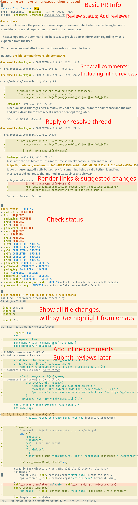

# Emacs PR Review

Review Github Pull Request from Emacs!




## Prepare

### Install

[](https://melpa.org/#/pr-review)

### Setup github token

This project uses [ghub](https://magit.vc/manual/ghub/Creating-and-Storing-a-Token.html#Creating-and-Storing-a-Token),
see its document for more details about how to setup the token.

Simply put, add the following line to `~/.authinfo` (replace `<...>` accordingly):

```
machine api.github.com login <YOUR_USERNAME>^emacs-pr-review password <YOUR_GITHUB_PERSONAL_TOKEN>
```

You may customize username and api host (for github enterprise instances) using [ghub](https://magit.vc/manual/ghub/Github-Configuration-Variables.html#Github-Configuration-Variables),
or you can also set `pr-review-ghub-username` and `pr-review-ghub-host` for pr-review only.

<details>
  <summary>For github enterprise users</summary>
  
The detailed setup for different github enterprise sites may vary. Just for reference:
  
  1. set pr-review-ghub-host to "github.corp.my-company.com/api/v3"
  2. set pr-review-ghub-username
  3. in ~/.authinfo, use `machine github.corp.my-company.com/api/v3 login my-username^emacs-pr-review password ghp_xxxxxxxxxxxx`

</details>

## Usage

This package provides the following entrypoint:

- `M-x pr-review`: open a PR with given URL.
- `M-x pr-review-notification`: list github notifications in a buffer, and open PRs from it
- `M-x pr-review-search-open`: search in github and select a PR from search result.
- `M-x pr-review-search`: like above, but list results in a buffer

Suggested config (especially for evil users):

```elisp
(evil-ex-define-cmd "prr" #'pr-review)
(evil-ex-define-cmd "prs" #'pr-review-search)
(evil-ex-define-cmd "prn" #'pr-review-notification)
(add-to-list 'browse-url-default-handlers
             '(pr-review-url-parse . pr-review-open-url))
```

Personally I suggest two possible workflows:

1. Use `pr-review-notification` as your "dashboard" and enter PR review from it.
2. Use [notmuch](https://notmuchmail.org/notmuch-emacs/) (or some other email client in emacs) to
receive and read all github notification emails and start `pr-review` from the notmuch message buffer.
Running `pr-review` in the email buffer will automatically find the PR url in the email.


### Keybindings in PrReview buffer

There's three most-used keybindings:

- `C-c C-c`: add a comment based on current context.
  - When current point is on a review thread, add a comment to current thread;
  - When current point in on the changed files, add a pending review thread to current changed line; you can also add it to multiple lines by selecting a region;
  - Otherwise, add a comment to the pull request.
- `C-c C-s`: perform some "action" based on current context.
  - When current point is on a review thread, resolve current thread;
  - When current point is on the changed files, or there are any pending reviews, prompt to submit the review with action;
  - Otherwise, prompt to merge, close or re-open the PR.
- `C-c C-e`: edit the content under point based on current context, the following items can be updated (if you have the right permission):
  - PR description
  - PR title
  - Comment
  - Comment in a review thread
  - Pending review thread

There's also buttons (clickable texts) for major actions (e.g. reply, submit review), you can just use them.

Some other keybindings:

- `C-c C-r`: refresh (reload) current buffer
- `C-c C-v`: view current changed file under point (either HEAD or BASE version, based on current point) in a separated buffer
- `C-c C-o`: open this pull request in browser
- `C-c C-q`: request reviewers
- `C-c C-l`: set labels

Evil users will also find some familiar keybindings. See `describe-mode` for more details.

### Keybindings in PrReviewInput buffer

When you are adding or editing the comment, you will be editing in a new PrReviewInput buffer.
Keybindings in this buffer:

- `C-c C-c`: Finish editing, confirm the content
- `C-c C-k`: Abort, drop the content
- `C-c @`: Mention some other (inserting `@username`)

### Keybindings in PrReviewNotification buffer

- `RET`: Open the PR (While this buffer lists all types of notifications, only Pull Requests can be opened by this package)
- `C-c C-n` / `C-c C-p` (`gj` / `gk` for evil users): next/prev page
- Refresh with `revert-buffer` (`gr` for evil users)
- `C-c C-t`: toggle filters

Actions in this buffer works like `dired`: items are first marked, then executed:

- `C-c C-r` (`r` for evil users): mark as read. Note that items are automatically marked as read when opened.
- `C-c C-d` (`d` for evil users): mark as unsubscribe (delete).
- `C-c C-s` (`x` for evil users): execute marks
- `C-c C-u` (`u` for evil users): unmark item
